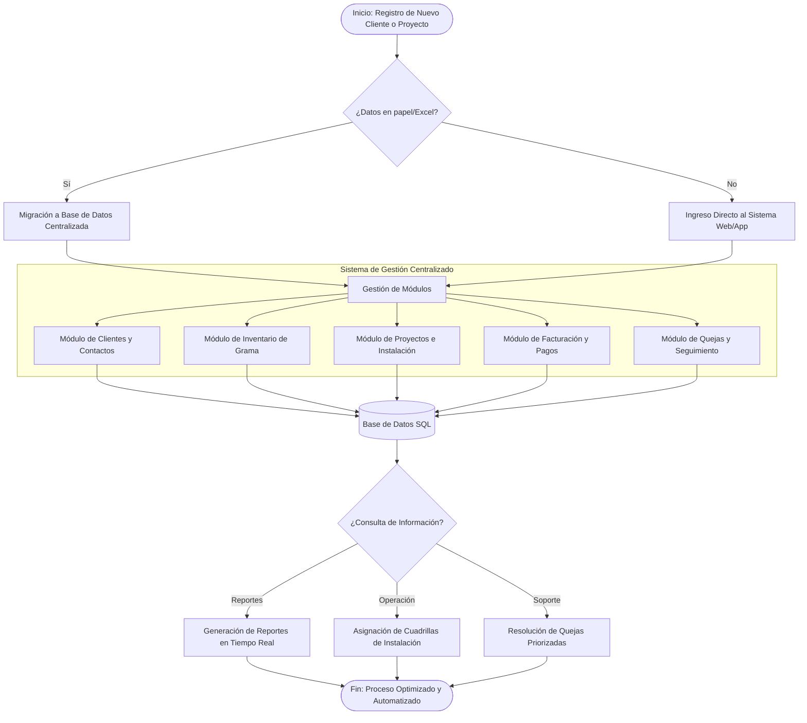

---

## Diagrama de flujo

## Diagrama de solucion

```mermaid
graph TD
    %% Estilos de los nodos
    classDef inicio endstyle fill:#f9f,stroke:#333,stroke-width:2px;
    classDef proceso fill:#fff,stroke:#333,stroke-width:1px;
    classDef baseDatos fill:#e1f5fe,stroke:#01579b,stroke-width:2px;

    A([Inicio: Registro de Nuevo Cliente o Proyecto]) --> B{¿Datos en papel/Excel?}
    
    B -- Sí --> C[Migración a Base de Datos Centralizada]
    B -- No --> D[Ingreso Directo al Sistema Web/App]

    C --> E[Gestión de Módulos]
    D --> E

    subgraph "Sistema de Gestión Centralizado"
        E --> E1[Módulo de Clientes y Contactos]
        E --> E2[Módulo de Inventario de Grama]
        E --> E3[Módulo de Proyectos e Instalación]
        E --> E4[Módulo de Facturación y Pagos]
        E --> E5[Módulo de Quejas y Seguimiento]
    end

    E1 & E2 & E3 & E4 & E5 --> F[(Base de Datos SQL)]

    F --> G{¿Consulta de Información?}
    
    G -- Reportes --> H[Generación de Reportes en Tiempo Real]
    G -- Operación --> I[Asignación de Cuadrillas de Instalación]
    G -- Soporte --> J[Resolución de Quejas Priorizadas]

    H & I & J --> K([Fin: Proceso Optimizado y Automatizado])

```

# Constancias

---

### Entrevista

### Creacion de tablero

### Elevator pitch

### Grabacion Junta Directiva

